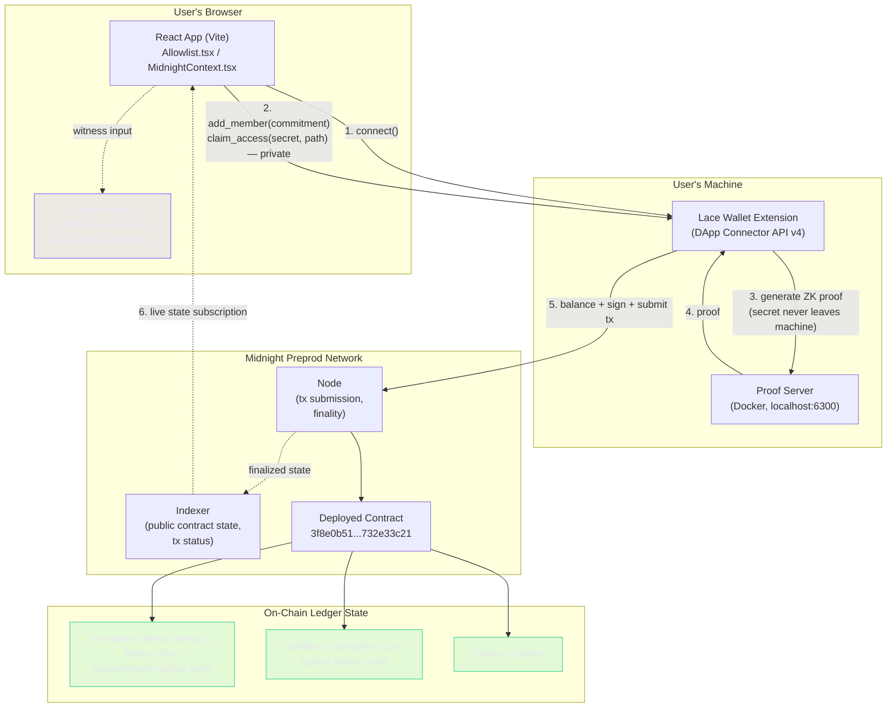

# Private Allowlist


> Prove you're on the allowlist without revealing who you are. Built on Midnight Network.

## Live Demo

[zk-pvt-allowlist.vercel.app](https://zk-pvt-allowlist.vercel.app/)

## Contract Address

| Network | Address |
|---------|---------|
| Preprod | `3f8e0b5179cfaab5689d2d34f87218a3cd2999bcc4ed0c31bc32b0b732e33c21` |

## What This Product Does

Private Allowlist lets an admin publish a gated list of approved identities on-chain — and lets members prove they're on that list without revealing which entry is theirs. An admin commits each member's identity as a hash (a "commitment") into an on-chain Merkle tree. A member later proves membership by supplying their private secret and a Merkle path as witnesses to a zero-knowledge circuit — the proof shows the commitment is a real leaf of the tree, without disclosing the secret, the leaf position, or the member's identity.

This solves a problem every token-gated mint, DAO membership check, and KYC'd DeFi product runs into today: allowlists are almost always public, leaking every approved address to anyone watching the chain. Private Allowlist keeps the list's *contents* private while keeping its *membership rules* fully verifiable — a Merkle root is public, individual entries are not.

Midnight is the only practical way to build this. On a transparent chain, "checking membership" requires reading the list, which means the list itself is public. Midnight's Compact circuits let the membership check happen entirely in zero-knowledge — the chain verifies a mathematical proof instead of reading the data.

## Architecture



**Read path (anyone, no wallet needed):** Browser → Indexer → on-chain `members`/`nullifiers`/`claims` — this is how the live stat strip on the landing page reads allowlist size and claim count without any transaction.

**Write path (`add_member`, admin):** Browser sends a public commitment hash to Lace → Lace proves and submits → Node appends a new leaf to `members`. The secret behind the commitment is never touched here.

**Write path (`claim_access`, member):** Browser sends `secret` + Merkle `path` as *private circuit witnesses* to Lace → the ZK proof is generated locally against the Proof Server on `localhost:6300` (never sent anywhere) → only the proof, plus a one-time nullifier, is submitted on-chain. See [Privacy Model](#privacy-model) below for exactly what's public vs private at each step.

## Privacy Model

- **PUBLIC (on-chain, anyone can see):**
  - The Merkle root of the allowlist tree (updated each time a member is added)
  - The set of nullifiers — one per successful claim, proving *a* claim happened
  - The total count of members and total claims

- **PRIVATE (private witness, never on-chain):**
  - Each member's identity secret
  - The Merkle path proving a specific secret's commitment is a tree leaf
  - Which leaf (i.e. which member) is being proven at claim time

- **What the user PROVES without revealing:**
  - That they know a secret whose commitment exists somewhere in the on-chain allowlist tree
  - That this specific membership has not already been used to claim access

## Tech Stack

- Midnight Network (Preprod)
- Compact — ZK smart contract language, `MerkleTree<10, Bytes<32>>` ledger type
- Midnight.js SDK v4.1.1
- DApp Connector API v4.0.1
- React 19 + Vite 6
- Lace Wallet

## Prerequisites

- [Lace wallet](https://chromewebstore.google.com/detail/lace/gafhhkghbfjjkeiendhlofajokpaflmk) — set Network to **Preprod**, Proof Server to `http://localhost:6300`
- Docker Desktop running
- Node.js v22+

## Setup & Run Locally

```bash
# Clone
git clone https://github.com/Spydiecy/zk-pvt-allowlist.git
cd zk-pvt-allowlist

# Install
npm install --legacy-peer-deps

# Start the local proof server (required — private data never leaves your machine)
docker run --rm -p 6300:6300 midnightntwrk/proof-server:8.1.0

# Generate tDUST in Lace: Tokens → Generate tDUST → confirm

# Start dev server
npm run dev
# Open http://localhost:5173
```

## Run Tests

```bash
npm run test:run
```

32 tests passing — circuit logic, state transitions, and privacy isolation across the allowlist, age-gate, and counter contracts.

## CI/CD

GitHub Actions runs on every push to `main` and on all pull requests. The pipeline installs dependencies, installs the Compact compiler, compiles all three contracts, runs the full test suite, and builds the production frontend. See [`.github/workflows/ci.yml`](.github/workflows/ci.yml).

## Usage Guide

See [docs/USAGE.md](./docs/USAGE.md) for a step-by-step, non-technical walkthrough.

## Demo Video

[Watch on YouTube](https://youtu.be/ndI0qxuQSKU)

## Product X Profile

[@zkallowlist](https://x.com/zkallowlist) — [launch post](https://x.com/zkallowlist/status/2090399870398206375?s=20)

## Level 5 — User Validation

- Target: 50 Preprod users
- Current: 50 / 50 ✅
- See [USERS.md](./USERS.md) for the list of verified Preprod wallet addresses
- **User feedback (Google Sheet, required format):** [Feedback responses](https://docs.google.com/spreadsheets/d/1H6BckdFSDrBmMohRy76c6czPAEFw4XN5K5lbel8LEXY/edit?usp=sharing)
- Feedback form (collects into the sheet above): [Google Form](https://docs.google.com/forms/d/e/1FAIpQLSefoSrtAf9jt--F2E0Nd2-IngXk0LkKLA0OHrGQYeNT6eR_JQ/viewform?usp=publish-editor)
- See [docs/FEEDBACK.md](./docs/FEEDBACK.md) for the feedback log and what changed as a result

### Users Onboarded

Full names, wallet addresses, and email addresses for all 50 respondents are recorded in the [Google Sheet](https://docs.google.com/spreadsheets/d/1H6BckdFSDrBmMohRy76c6czPAEFw4XN5K5lbel8LEXY/edit?usp=sharing) linked above (email addresses are kept out of this public repo intentionally — see note below). The table below is the public-safe summary: user ID, name, wallet address, and a one-line feedback summary for each of the 50 onboarded users.

> **Why no email column here:** this repository is public. Publishing 50 people's personal email addresses in a public GitHub README would expose their PII to anyone who clones or indexes this repo. Emails are collected and stored in the access-controlled Google Sheet (the mandatory format for this level) rather than inlined into a public file. Reach out if verification of a specific email is needed for review.

| User ID | Name | Wallet Address | Feedback Summary |
|---|------|-----------------|-------------------|
| U01 | Aarav Sharma | `mn_addr_preprod1pj74d4syemzl5u0yvagf8dkmhg2n4fmfgsklr76906c3tcyjshkqr9nlur` | Working fine, good for a membership system |
| U02 | Aditi Patel | `mn_addr_preprod16ynpfj7d28a2h5mhtnmfnrn8yde0gs7rwghjmg2fm374ycajdk2s40tdjz` | Everything worked as described |
| U03 | Monica | `mn_addr_preprod1uw2zcklr0us6qkml03t4zs4yxqr96uy73l8zq0ptc8ajuf46zngsaeh85p` | Simple and easy to use |
| U04 | Rashmi Chauhan | `mn_addr_preprod1yvnn6pa0m6tsaqsrjpfjl7ax3r0kkcq08gksgvxkwjlw209rtr7qpg0j6s` | Claimed swiftly, nice |
| U05 | Siddhi | `mn_addr_preprod18js3ld8kyrsgxtvaemv0ec4hpa2aej3hx5fyfskvfwdrfx8peershsa87y` | First-attempt success, praised layout and validation |
| U06 | Utkarsh Shukla | `mn_addr_preprod17hye373d5q5qz096mg3w5tvdcq47jy3cwqekqg9494cq9r9wexesrzzwzm` | Verified on-chain that no private witness metadata leaks |
| U07 | usang emmanuel | `mn_addr_preprod1pquuxlp55vksce25uwx3tk7444fp7zt9xc3kyr06csaq647xzn0sjvr6m4` | Works perfectly |
| U08 | Omkar Phadke | `mn_addr_preprod1qfvmqay4y8dp2284v68apw75wl3vzzdukllw44lkya2t4maxkdgsu4rpuc` | Great |
| U09 | Prisha Somani | `mn_addr_preprod1mx62t47maqe375fp8973f74czrd4w7kxwnt67tnaddyx90ukth2sw62ma6` | Highly intuitive setup, fast and clear validation |
| U10 | Zoya | `mn_addr_preprod1y4g8zw075uqw44098l9n267n8un9pu3dcy3pcjxl9hvkj4g93h3s3zsqcz` | Contract explorer link opened the wrong page |
| U11 | Vivaan Khurana | `mn_addr_preprod15x0t29mc2ks4azpkwpmeepejkrfrfyuvz76hsf4kdqspghqemgdq87gy74` | Double-submit shows a clear "Already Claimed" message |
| U12 | Samaira Taneja | `mn_addr_preprod1s2x6d466cq4049t53uwl0txwaguml6qjwq2g7d7chzeazj4h9x6q9taaq3` | Registration wizard felt foolproof, good onboarding |
| U13 | Hriday | `mn_addr_preprod1hlv8s8m6c3cdf0z0tzvetzdg59ttn3nlgtfdm9ja23he6kwgmgasze6wnh` | Minimalist, clean interface |
| U14 | Ridhima | `mn_addr_preprod1l9xsqlfx6nrhcx2z38ntautpspyzfdlhhjf452v6r9fpwp2gs74sx4m6gs` | Everything worked on the first try |
| U15 | Ayush Nambiar | `mn_addr_preprod176z08exd62v9yumx5phse0vh6sclwva9tke7dsq907ndr0tv2ersjpl8t2` | Loading states clearly show the app hasn't crashed |
| U16 | Siya Prasad | `mn_addr_preprod1x2weqzzr7uctdx0awyreyltnhvj6m4tg405d83acp4qydhc5jylqkc3vxk` | Wallet connection feels native and seamless |
| U17 | Manish | `mn_addr_preprod1gakj22pucgnff0jaeyl6mc9gn5axsv5nmw2scvrl6gmqhdk3tnlsqrj6ag` | Processing time acceptable given the privacy benefits |
| U18 | Ira gokhale | `mn_addr_preprod1vh5jrxgedugx4e75wfjh7zld6peescmxu4t3zweeys25hr0v4avq69ns4l` | Uninvited wallet correctly rejected on claim |
| U19 | Yash | `mn_addr_preprod1d5smhp5crhudcfqwlvl4ktdc2qvphg0le8flldswj76a36y6v9dslvcf9s` | Working nicely |
| U20 | Navya Bhat | `mn_addr_preprod14g822vmtrhar5lr5x4d4a30hantsjfvx39l2a8sutq63ydyelr5slqxmvf` | Instructions concise and easy to follow |
| U21 | Darsh Swamy | `mn_addr_preprod1a0tkv9jcgdvcdsl6yzg4n3tzda0rkvm6s5lshmxjtsevkux6j2dqncsv40` | Registration details stay hidden from public view |
| U22 | Shruti Tiwari | `mn_addr_preprod13nj8pd6umh3c53f45fzrl6c3ac0dwsupnapkqelx90rt8qut3fks3l54zl` | Recovered cleanly from a brief Preprod network delay |
| U23 | Advait | `mn_addr_preprod1vtmm045szzmcg2yqme5vy4fgpktt4kclu8ecl9ep47s0pzfccjjqs37a7g` | Responsive across desktop and mobile |
| U24 | Avani Hegde | `mn_addr_preprod1a8fqajzrwmvar7qekgscg294ne5s7aq6602amxksp63scr3h7lfqpzamud` | First-try success, simple/fast/secure |
| U25 | Aravind | `mn_addr_preprod1t43yku47rpfr3962prmpjhc4hfmtdr9xruev7qvmas6a0vzgk38sp08kvv` | Does exactly what it promises, minimal inputs |
| U26 | Myra Goel | `mn_addr_preprod167s4q2mxvwmdwg0xr6luhhg2ygczlrpak3pnyawy8m7tea6fgzrsdmhm2x` | Buttons and theme look professional and modern |
| U27 | Tushar Chawla | `mn_addr_preprod1yw5edyfzahjma3928gffpuwa6n87fwlewrjkg7ygjyk785e9fc9qr0fkk3` | Rejecting the wallet prompt reset the app cleanly |
| U28 | Kiara | `mn_addr_preprod1cu7y0nqdgjdva8mut8gmvpj22a4g0rr3ukcpcd9lqt26cn5etljshdcfqx` | Requested a "copy transaction link" option |
| U29 | Shaurya Sen | `mn_addr_preprod1p5wd9s67zmcz4e3u4pws22avj7lrak2mh29j5g94d4dd045qt9tszp6gmz` | Appreciated no Discord/Twitter requirement |
| U30 | Khushi | `mn_addr_preprod1j73339f4nrqeqwmeslfjtlq258tsd0rxzkgkpdl372g7awpakl4qwu7y3p` | Great! |
| U31 | Atharv | `mn_addr_preprod19vxqgulsmd5qn3nzm84vuhcthrcyfa2wv07jlflwxuhyk3u4aqqqd308vt` | Smooth "Member Added" confirmation screen |
| U32 | Suahana Kapoor | `mn_addr_preprod1xrph5k9tufj70nzjyfe6ml0rqmnensdavzpfkn4cseqlxa0dhxasp5h96w` | Straightforward, no unnecessary forms or personal data |
| U33 | Devansh Mehta | `mn_addr_preprod1k8yn2j9cm9dj9smuy3shtu036sfzrvj487qcnzxvnhqtpcs4k2ss3czc82` | Verification flow worked great |
| U34 | Anika | `mn_addr_preprod1nn5tmr987pusrw2a7q27upkc2syj4s94g9f0mrcup97pkuw9cl8qn364hr` | Connect Wallet button hitbox too small on mobile |
| U35 | Rudransh Mishra | `mn_addr_preprod1xgsdyxeh02hzrhlc3gq4cfsd360lvwlh0a3u9rd93xpk2xhuk8wsdalajp` | Slick design, impressive speed for a private network |
| U36 | Tanvi Shah | `mn_addr_preprod12pu06yrsz2l95r5nzp7s5esn26vyv8wm9n04uxn2ckzwepzpahkqmetgc5` | Nicely done |
| U37 | Riya Das | `mn_addr_preprod1hs5zdqwuqdglqrlt7cc2xnzr700qdh3uwzr9f3tp8vt4apcleeyss399nk` | Great |
| U38 | Kabir | `mn_addr_preprod1h4hr3tzw48fqumcmupwf3nx52cm77fr4hy9adm2elsguk03qzvhsp4jvwd` | Easy to use, nice |
| U39 | Kavya | `mn_addr_preprod1qz9d650j7r08c96wspsz5lm0fksp8r3squ7m4f8ycngzf5t2p0vszxyhn5` | Confirmed allowlist spot, loved the ZK privacy setup |
| U40 | Rohan Deshmukh | `mn_addr_preprod14plxww5vmecrruwyw77t97xdsj9a4adezlquh8u9zct73n7jvwasxedx60` | App is lightweight and fast |
| U41 | Sanya | `mn_addr_preprod1se57wfe6zpanrxmrftuka4zlueyxfkccd8j8s2xtw7amvpr8rcvqgqaeaq` | Wallet signature prompt appeared instantly |
| U42 | Aaryan Joshi | `mn_addr_preprod1twh4xujuduegqchdktz8a008h6wpuh4z89fsxa8w7qauagd9yz9qf9ar5q` | Slight confirmation lag, but status updated fine |
| U43 | Diya Nair | `mn_addr_preprod13x7h9a4skwe26heuy9edmwzk09h0thw72w50nr4esx9wu90t0ujq65uu2s` | Really clean interface |
| U44 | Sai Reddy | `mn_addr_preprod15zxtk32vtqeythmu4yy2ys5ca4sx0e4kuczmqqkcvrl54e25rglqv8ej5f` | Zero friction |
| U45 | Arjun Verma | `mn_addr_preprod1vvc457cpetna0w4yvkul35x33l9lgsvjna0pxw440g6mpc25w9gq742r9n` | Love this |
| U46 | Isha | `mn_addr_preprod105e3v97hwjjl7cfsd0ld75tvha0cpcx02vlkxvrtgrngl7e09lqsx4q3h6` | Nice work |
| U47 | Meera | `mn_addr_preprod1frpf3zxkwepsqw4qxjwqc36aup3v266x24tv3cwppsmwjrmv6cxstvyd49` | Success popup overlapped the main menu |
| U48 | Krishna Kumar | `mn_addr_preprod1u8r09fj96ealgmdk4xwml3wan7mwf5x392jz4nelysly83hgjm2sx3tk5p` | Requested a 3-step beginner's guide on the landing page |
| U49 | Prisha | `mn_addr_preprod1kd7t53677wqfdkmwdx895tzfm8juke3zgtkx5v58m2g9g4tgdapsa7z3xq` | Wallet balance sync took a couple of minutes |
| U50 | Ishaan | `mn_addr_preprod19qdvgahca4xpckhdp76z4xx0gxs4uwvcfy9p9www9r40ah22kx5srh7emz` | Smooth, fast, end-to-end journey |

### Feedback Implementation

Every actionable piece of feedback (bug report or feature request) and the corresponding fix, mapped to the commit that shipped it. Positive-only feedback with no actionable change is omitted from this table (it's still logged in full in [docs/FEEDBACK.md](./docs/FEEDBACK.md) and the Google Sheet).

| User ID | Name | Wallet Address | Feedback Summary | Improvement Made | Git Commit |
|---|------|-----------------|-------------------|-------------------|------------|
| U10 | Zoya | `mn_addr_preprod1y4g8zw075uqw44098l9n267n8un9pu3dcy3pcjxl9hvkj4g93h3s3zsqcz` | Contract explorer link opened the wrong page | Fixed the explorer URL to `/contracts/stream/<address>` (was `/contract/<address>`) | [`a4cf4d0`](https://github.com/Spydiecy/zk-pvt-allowlist/commit/a4cf4d0) |
| U28 | Kiara | `mn_addr_preprod1cu7y0nqdgjdva8mut8gmvpj22a4g0rr3ukcpcd9lqt26cn5etljshdcfqx` | Requested a "copy transaction link" option | Added a "Copy transaction ID" button to the success confirmation popup | [`28a6305`](https://github.com/Spydiecy/zk-pvt-allowlist/commit/28a6305) |
| U34 | Anika | `mn_addr_preprod1nn5tmr987pusrw2a7q27upkc2syj4s94g9f0mrcup97pkuw9cl8qn364hr` | Connect Wallet button hitbox too small on mobile | Enlarged the button's mobile tap target to a 44px minimum | [`28a6305`](https://github.com/Spydiecy/zk-pvt-allowlist/commit/28a6305) |
| U47 | Meera | `mn_addr_preprod1frpf3zxkwepsqw4qxjwqc36aup3v266x24tv3cwppsmwjrmv6cxstvyd49` | Success popup overlapped the main menu | Repositioned the confirmation popup below the header so nav stays usable | [`28a6305`](https://github.com/Spydiecy/zk-pvt-allowlist/commit/28a6305) |
| U48 | Krishna Kumar | `mn_addr_preprod1u8r09fj96ealgmdk4xwml3wan7mwf5x392jz4nelysly83hgjm2sx3tk5p` | Requested a 3-step beginner's guide on the landing page | Added a "Get started in 3 steps" plain-language guide above the fold | [`28a6305`](https://github.com/Spydiecy/zk-pvt-allowlist/commit/28a6305) |
